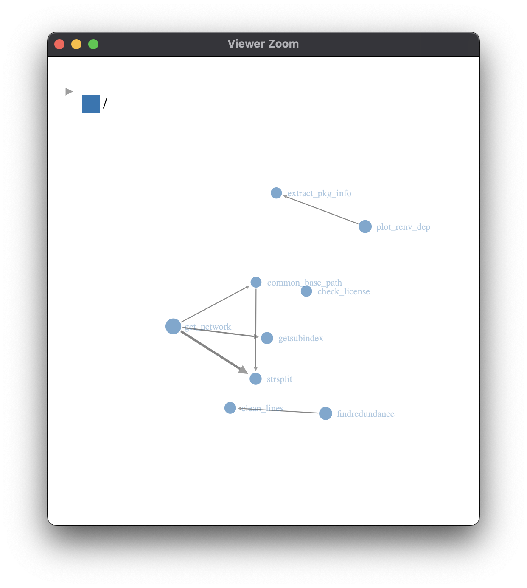
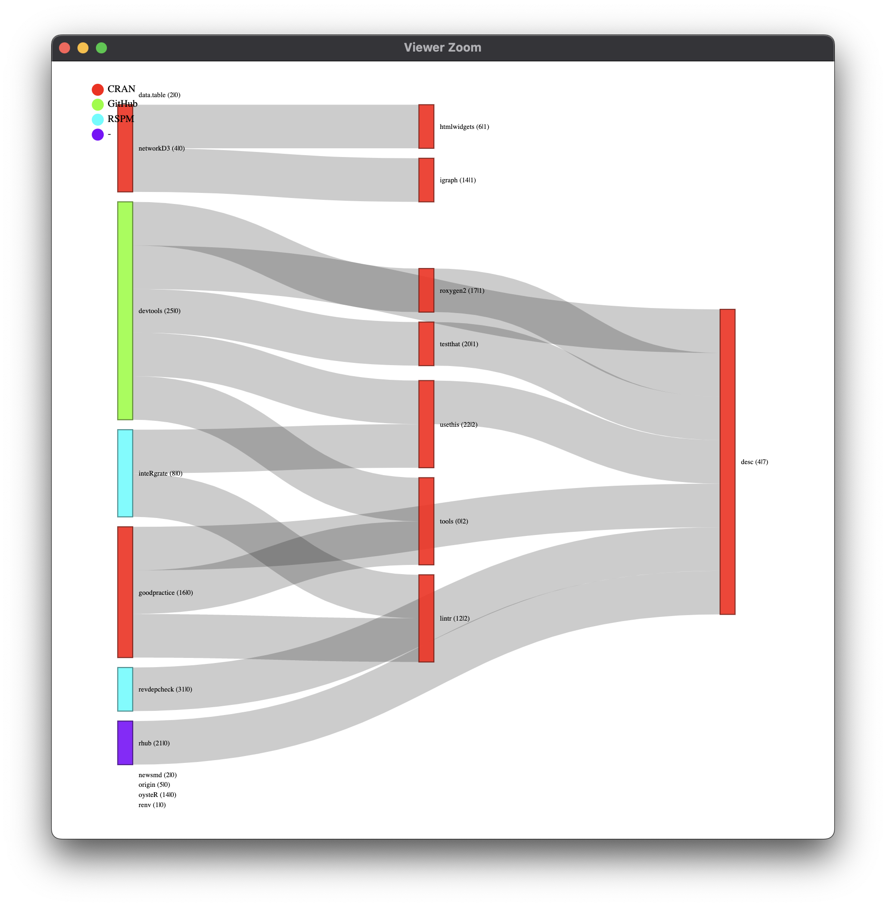

# codeAnalyseR - 0.0.0.9003 


----

A package to analyse your custom R scripts.

## Installation

``` R
renv::install("dschaykib/codeAnalyseR")

```


## Motivation for `codeAnalyseR`

Have you ever got a project from a colleague or from a client and had no idea what's inside or how it works?

Well, I been there a few times... and to make my life easier, I want a functionality, that gives me an overview of an existing project. I want to know:

- how the functions are connected?
- what packages are used?
- how much of the code might be duplicated?
- ...

For this purpose I wrote and collected some functions and put them all in this package.

I hope you might find some of these helpful. If you have similar functions or check for more things, let me know!


## How to use `codeAnalyseR`

At the moment there are the following functions to use:

### get_network()
  This Function plots user defined functions and shows how they are connected.
  
  
### plot_renv_dep()
  Plots the dependencies stated in a `renv.lock` file and creates a sankey plot. In Addition the used licenses are displayed by color.
  
  
### findredundance()
  This functions checks the provided code for duplicated rows and states how many percent of the code could be reduced.
  
  ```
     chunk_size found max_dups total_dups      rest
  2          10     1        2          2 0.9805637
  5           7     1        3          3 0.9601555
  8           4     1        2          2 0.9533528
  9           3     3        2          6 0.9358601
  10          2     9        5         26 0.8853256
  ```


