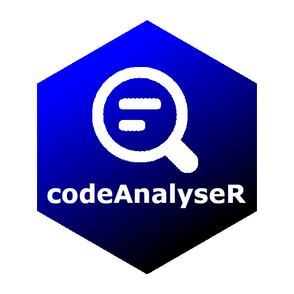

# codeAnalyseR - 0.0.0.9002 


----

A package to analyse your custom R scripts.

## Installation

``` R
renv::install("dschaykib/codeAnalyseR")

```


## Usage of `codeAnalyseR`

Have you ever got a project from a colleague or from a client and had no idea what's inside or how it works?

Well, I been there a few times... and to make my life easier, I want a functionality, that gives me an overview of an existing project. I want to know:

- how the functions are connected?
- what packages are used?
- how much of the code might be duplicated?
- ...

For this purpose I wrote and collected some functions and put them all in this package.

I hope you might find some of these helpful. If you have similar functions or check for more things, let me know!


